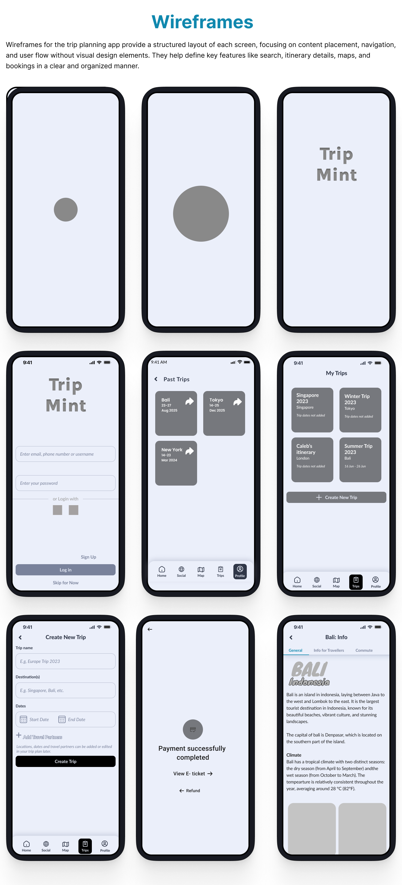
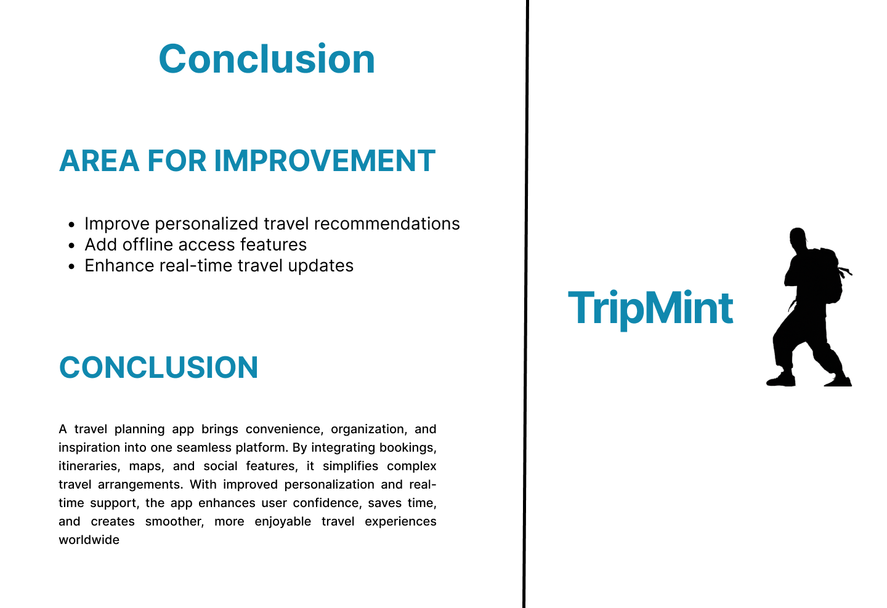

# Trip-Mint – UX Case Study

A travel planning app designed to help users discover destinations, create 
personalized itineraries, and manage bookings seamlessly, offering a smooth 
and enjoyable trip planning experience.

---

## 🌍 Project Overview

---

## ❓ Problem Statement

---

## 🔍 Primary Research

## Qualitative Research

## Quantitative Research

## Secondary Research

---

## 👤 User Personas

## 🗺️ User Flow

## 🔍 User Research

---

## 📊 Competitor Analysis

## 📊 SWOT Analysis

---

## 💡 Ideating Possible Solutions

---

## 🏗️ Design Thinking Process

## 📅 Design Timeline

## ✏️ Paper Sketching

## 📐 Wireframes

---

## 🏛️ Information Architecture

---

## 🎨 Design System

---

## 🖥️ Visual Designs

---

## 🧪 Usability Testing

---

## ✅ Conclusion

---

## 🙏 Thank You

